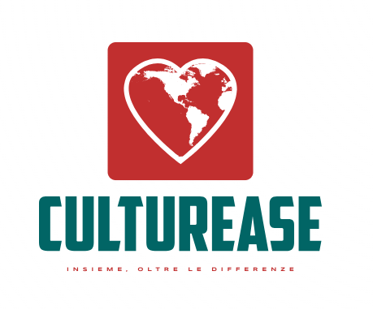

### CulturEase HCI

**CulturEase** is a web based app, but more in general a project, to support the refugees and migrants reception center in Cervinara(AV).
Our goal was to create a system that helped staff in the center in everyday activities, and to offer those in needs a way to improve integration and communication both inside the center and, in the end, in the society.
This project originated from a university course about Human Computer Interaction, but the end goal is to make it work and be actually useful in the context that it was designed for.
